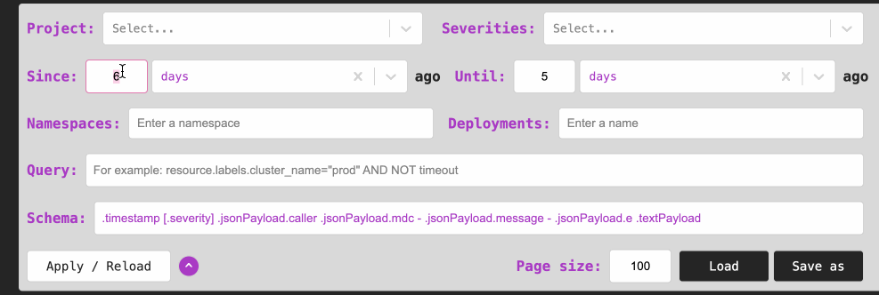

# Googlogs

VSCode extension to view Google Cloud Logs.

## Install from Release

* Download `vsix` from release page.
* From VSCode’s main menu, select “Extensions”.
* Click to open the three-dot menu at the top of the middle panel.
* Select "Install from VSIX..." and follow the prompts.

## Search Options

Currently, we only search for `resource.type="k8s_container"`. Other options are alo affiliated with GKE.

`Query` uses same syntax and properties as the cloud logs search. See [Logging query language](https://cloud.google.com/logging/docs/view/logging-query-language).

`Schema` is used to parse the results into raw log lines. Any log property should be prefixed with `.`. You can access nested properties with the dot notation. For example, `.labels.pod_name` will access the `pod_name` property of the `labels` property.

`Namespaces` and `Deployments` names are not validated or autocompleted, use with your own knowledge.

## Development

`yarn browser` to run app in browser with data mocks.

Launch from vscode to debug.

`yarn vsix` to build `.vsix` file. `yarn vsix-install` to install the extension to your local vscode.
