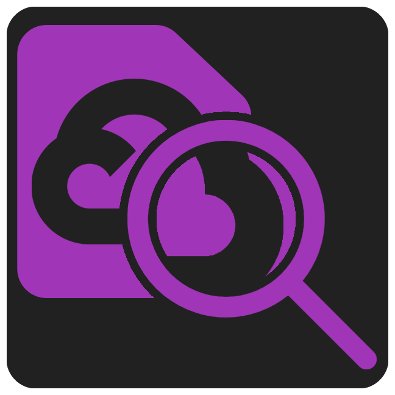

# Googlogs

VSCode extension to view Google Cloud Logs.

## Development

`yarn browser` to run app in browser with data mocks.

Launch from vscode to debug.

`yarn vsix` to build `.vsix` file. `yarn vsix-install` to install the extension to your local vscode.
